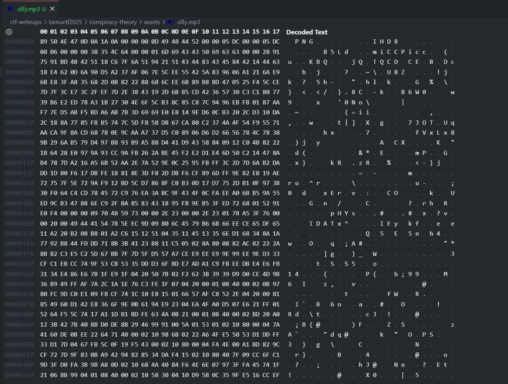
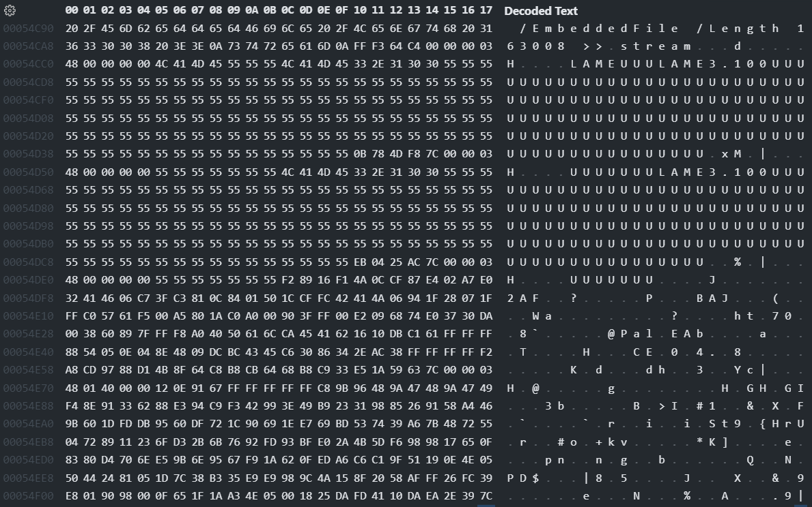
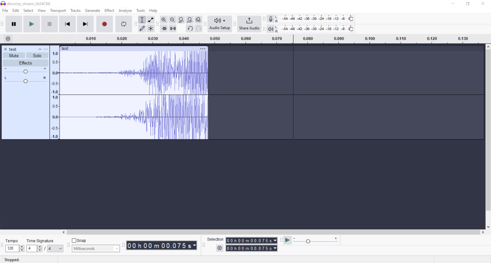

# Conspiracy Theory

- Author: `moveslow`
- Type: `Forensics`
- Original: https://github.com/tamuctf/tamuctf-2025/tree/main/forensics/conspiracy-theory

## Preamble

Something I've always said for a long time (8 years) is that file extensions aren't real. Even as a kid, I would ignore the weird warning from windows that says that removing the file extension might make the file stop working and changes gifs to pngs to jpegs.

Files are just a big thing of bits that we call a file, meaning we can do all sorts of things. For example, you can just kind of put a file in another file. I mean, I could do it in text too. Take a look:

```json
{
    "message": "Hello"
}
```

There's now a json file inside of this markdown file. Neat!

This works for binary data too, so you can just kind of put anything wherever. This is why you can watch videos with audio; they have both image and audio data inside of them!

As a result, there are *tons* of forensics challenges that simply embed one file in another and call it a day. This challenge includes file embedding, but also adds another layer of complexity you'll see in a moment.

## Solution

So sound files are cool. Have you ever looked at a hexdump of an mp3 file? It's pretty cool. Look:



Haha, I tricked you! Or maybe I didn't because you have eyeballs and can see the first 3 letters in the hexdump. This is actually a *png* file! Remember when I said file extensions aren't real? This is the actual file:


Now, why does this matter? Well, if you're silly like me and forget that tools like binwalk or pdf parser exist, then you'll just browse hex data because it's fun. Now, if we look at the various streams in the pdf for the challenge, we can see this



Oh wow, that's a bunch of things that say "LAME". I wonder what that could mean. Well, if you're like me, you've already looked at a bunch of random hex dumps and know that LAME is an mp3 encoder. Dunno why it has a bunch of padding (probably because of compression or something idk), but that's what's happening.

So, what, do we just copy the data into another file and play it? I mean, you *could*, but this is what you get:



That's kinda weird, right? It's not even a second long, but it looks sorta like audio. We must be on the right track.

Quick lesson on MP3 files. They are split up like this:

```
<tags>
header
data
------
header
data
------
header
data
```

The tags part isn't necessary, but some people like it because it makes gives more data that user's might care about. 

Now, the data part doesn't *have* to be the same length throughout, but if someone without a lot of time were to make an audio file (for example: a stressed out ctf challenge designer), they're gonna just have each data segment be the same length.

So how do we get the length of the data? It's not hard, but for some reason the resources for it are atrocious. It all comes down to that first header. We know the first header is right, because the audio looks like audio (shocker, I know, but usually it will look like random noise if the header's wrong). So, what's the header? MP3 file headers are formatted like this:

```
Each 0 represents an individual bit
00000000000 | 00 | 00 | 0 | 0000 | 00 | 0 | 0 | 00 | 00 | 0 | 0 | 00
```

The first 11 bits indicate "header start" and are always set to 1. The next 2 indicate the version, then the audio layer, CRC protection, bitrate, sampling rate, padding, and a bunch of other stuff that we don't really care about.

The header in our embedded audio stream is `0xFFF364C4`, which in binary looks like this:

```
11111111111 | 10 | 01 | 1 | 0110 | 01 | 0 | 0 | 11 | 00 | 0 | 1 | 00
```

If we consult some mp3 spec tables, we can parse the following from the header:

```
MPEG Version 2
Layer 3
No CRC protection (thank goodness)
Bitrate index 0b0110
Sampling rate index 0b01

The rest doesn't matter to us...
```

Now, we can use some online tables to get the amount of bytes each header should be at. I used the one [here](https://www.codeproject.com/Articles/8295/MPEG-Audio-Frame-Header):

```python
padding_size = 0
sampling_rate = 24000
bitrate = 48 * 1000
samples_per_frame = 576

frame_size = ((samples_per_frame // 8 * bitrate) // sampling_rate) + padding_size
```

Now, all we need to do is copy our header `0xFFF364C4` every `frame_size` bytes:

```python
buf = b""

# Open the decompressed audio stream (it wasn't actually compressed :P)
with open("decomp_stream_0x54CB8.mp3", "rb") as f:
    buf = f.read()

header = bytes([0xFF, 0xF3, 0x64, 0xC4])

padding_size = 0
sampling_rate = 24000
bitrate = 48 * 1000
samples_per_frame = 576

frame_size = ((samples_per_frame // 8 * bitrate) // sampling_rate) + padding_size

buf.replace(b"LAME", bytes(header) + b"LAME")
final_buf = []

for i, byte in enumerate(buf):
    if(i % (frame_size) in [0, 1, 2, 3] and i != 0):
        final_buf.append(header[i % (frame_size)])
    else:
        final_buf.append(byte)

with open(f"solution.mp3", "wb") as out:
    out.write(bytes(final_buf))
```

Then, we get an audio file that says the flag. For some reason, the embedded audio file has two solutions:

```
gigem{mp3_is_so_free_electric_beegalee}
gigem{mp3_is_free_electric_beegalee}
```

The correct one was `gigem{mp3_is_so_free_electric_beegalee}`, so yay!

If you got this far, I appreciate you reading the ramblings of an insane man that forgot you can just use do `file <filename>` and get most of the metadata instantly.

```bash
$ file solution.mp3
> solution.mp3: MPEG ADTS, layer III, v2,  48 kbps, 24 kHz, Monaural
```
